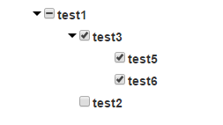

<html ng-app="testmodule">
<head lang="en">
    <meta charset="UTF-8">
    <title></title>
    <link rel="stylesheet" href="src/main/webapp/css/bootstrap.css">
    <link href="src/main/webapp/css/bootstrap-theme.css">
    
    
    
    
    
    <link rel="stylesheet" href="src/main/webapp/css/treeview.css">
</head>
<body ng-controller="testcontroller">
<h1>Treeview</h1>

Angularjs treeview with three stated checkbox

<h2>Properties</h2>
<ul>
    <li>treeviewLabel</li>
    <li>treeviewChild</li>
    <li>treeviewSource</li>
    <li>treeviewTarget</li>

</ul>
<h2>Usage</h2>
<h3>Javascript</h3>
<pre>
    <code>
angular.module('testmodule', ['treemodule']).controller('testcontroller', function ($scope) {
    $scope.dataSource = [{
        id: 1, name: 'test1',
        childs: [{
            id: 2, name: 'test3',
            childs: [{id: 3, name: 'test5'},
                {id: 4, name: 'test6'}]
        },
            {id: 5, name: 'test2'}]
    }];
    $scope.dataTarget = [{id: 2, name: 'test3'}];
})
    </code>
</pre>

 
<h3>Html Code</h3>
<pre>
    <code>
        &lt;div treeview-id="id"
                treeview treeview-label="name"
                treeview-child="childs"
                treeview-source="dataSource"
                treeview-target="dataTarget"&gt;
        &lt;/div&gt;
    </code>
</pre>
 
<h3>Result</h3>

</body>
</html>